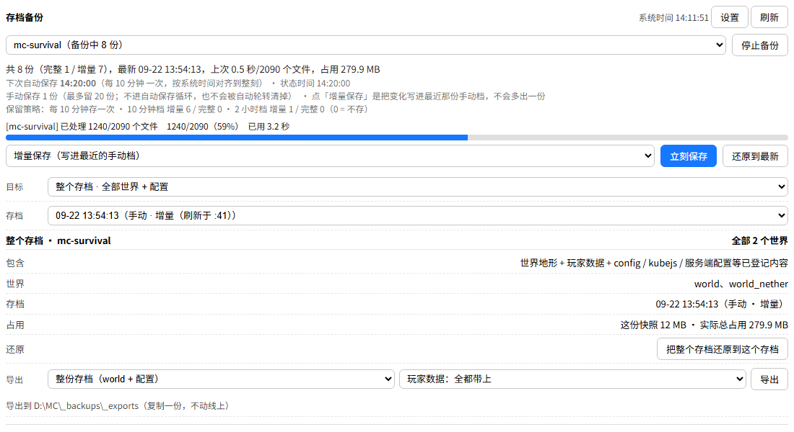

# MCSManager 存档备份组件（mc-backup）

给 **MCSManager**（面板 + 节点）用的 Minecraft **多服务端滚动备份**组件：定时增量快照、按时间段分档保留、世界 / 玩家 / 区块级回档、整包导出，全部在面板卡片上点。

> 两个文件就能跑：`src/mc-backup.js`（引擎，含一键安装）+ `web/card-backup.html`（面板卡片）。
> **只依赖 Node**（MCSManager 本身就带），Windows 和 Linux 用同一份代码，不需要装 PowerShell、7-Zip 之类的东西。



## 特性

- **增量快照**：默认每 10 分钟存一份，只写变化的文件（硬链接复用没变的），几十 GB 的整合包也能秒级完成
- **自动存档对齐系统整刻**：10 分钟档就是 12:00 / 12:10 / 12:20…，2 小时档就是 12:00 / 14:00…，不会因为程序什么时候启动而一直偏着几分钟
- **分档保留，一档两列**：`增量留几份 / 完整留几份`，**填 0 就是不存**；粗档按自然时间段各钉一份，10 分钟档转多少圈都挤不掉它
- **手动档独立成链**：面板上点「立刻保存 / 全部保存」产生的快照标成手动档，不进自动保存循环、不被自动轮转清掉。
  **「立刻保存」= 刷新最近那份手动档**（变化写进去、没变的不动、删掉的也跟着删，**不会多出一份**）；
  **「全部保存」= 另起一份**独立的完整复制（可以单独拿走），之后「立刻保存」就是刷新这一份
- **回档粒度**：整个存档 / 单个世界 / 单个玩家，进阶里还有按坐标**只回档一个区块**或**整个区域**、查区块在各快照里的变化历史
- **导出**：整份存档 / 单个世界 / 单个玩家 / 整个服务端 / 纯净服务端（不含存档和玩家），玩家数据可选带全部 / 不带 / 只带某一个
- **面板可视化**：进度条（进行中蓝色、完成绿色保留 90 秒）、下次自动保存时间、系统时间、存档按档位分组的下拉
- **GTNH 适配**：`World` 大写目录、`players/名字.dat`、个人维度 `DIM-xxx`、`serverutilities` / `journeymap` / `java9args.txt` 等
- **安全**：回档/转移前先自动停服并把当前文件另存一份（`_manual/`），做完自动开服

## 安装

### Windows / Linux 通用（推荐）

1. 把 `src/mc-backup.js` 和 `web/card-backup.html` 放到一个目录（例如 `D:\MCSM\backup-plugin\`）
2. 在面板里新建一个**通用进程**实例（名字随意，例如"备份服务"），启动命令：

   ```
   "C:\Program Files\nodejs\node.exe" "D:\MCSM\backup-plugin\mc-backup.js" watch --config "D:\MCSM\backup-plugin\mc-backup-config.json"
   ```

   Linux 上把 `node.exe` 换成 `node`、路径换成对应的即可。开启「自动启动 + 崩溃自动重启」。
3. 先跑一次一键安装（会在 MCSManager 里自动建实例、装卡片、生成配置）：

   ```bash
   node mc-backup.js install --yes
   ```
4. 打开面板首页，会出现「存档备份」卡片。第一次点「刷新」，然后按需改设置。

详细步骤、参数说明、常见问题见 **[docs/安装说明.md](docs/安装说明.md)**。

> 也可以不用一键安装：自己建实例 + 按 `examples/mc-backup-config.example.json` 写配置 + 把卡片放到面板的 `web/public/upload_files/` 下并在布局里引用。

## 配置速查

配置文件（`mc-backup-config.json`）里几个常用项：

| 字段 | 说明 |
| --- | --- |
| `backupRoot` | 备份根目录（**必须和游戏服同一分区**，否则硬链接用不了） |
| `baseMinutes` | 自动存档间隔（分钟） |
| `tiers` | 档位表 `[{minutes, keep, full}]`，`keep` = 增量份数、`full` = 完整档份数，0 = 不存 |
| `manualKeep` | 手动档最多留几份（默认 20） |
| `include` | 要备份哪些文件/目录（相对实例目录） |
| `excludeFileNames` | 排除的文件名（默认 `session.lock`） |
| `minFreeGB` | 剩余空间低于这个值就告警 |
| `instances` | 要备份的实例：`uuid` / `name` / `dir` / `enabled` / `notes` |

改配置最省事的方式是在**面板卡片上改**（设置 → 保存设置），引擎会立刻按新策略清理一次并写回配置文件。

## 目录结构

| 路径 | 说明 |
| --- | --- |
| [`src/mc-backup.js`](src/mc-backup.js) | 引擎：快照 / 回档 / 导出 / 保留策略 / 一键安装 |
| [`web/card-backup.html`](web/card-backup.html) | 面板卡片（MCSManager 插件卡片） |
| [`docs/安装说明.md`](docs/安装说明.md) | 安装 / 配置 / 常见问题 |
| [`docs/索引.md`](docs/索引.md) | **代码与数据格式全索引**（文件 → 函数 → 队列请求 → JSON 字段） |
| [`examples/mc-backup-config.example.json`](examples/mc-backup-config.example.json) | 配置样例 |
| [`tests/`](tests) | 自动化测试（沙盒全功能 / 卡片 / 链路 / 保留策略） |
| [`AGENTS.md`](AGENTS.md) | 给 AI 编码助手看的项目说明与硬性约定 |

## 测试

```bash
node tests/sandbox-test.js     # 沙盒全功能：真实引擎 + 假 GTNH 服务端，跑完所有面板请求
node tests/chain-test.js       # 手动/自动两条链 + 保留策略
node tests/card-test.js        # 卡片脚本（假 DOM）
node tests/retention-test.js   # 时间段锚点 vs 旧算法对比
```

CI 见 [`.github/workflows/test.yml`](.github/workflows/test.yml)（Ubuntu + Node 20）。

## 常见问题

- **卡片显示"读取失败 / 队列路径为空"**：状态文件还没生成，到插件目录跑一次 `node mc-backup.js status`
- **备份目录选哪**：必须和游戏服**同一分区**，跨分区硬链接用不了，每份快照都要完整复制
- **换了新卡片面板上没变化**：面板对卡片文件缓存 24 小时，把布局里 `card-backup.html?v=` 后面那串数字改掉再刷新（见 `AGENTS.md`）
- **点了「全部保存」却被清掉**：档位表里各档"完整留"都是 0，需要把某一档的完整份数改成 1

更多见 [docs/安装说明.md](docs/安装说明.md) 的常见问题一节。

## 许可

[MIT](LICENSE)
